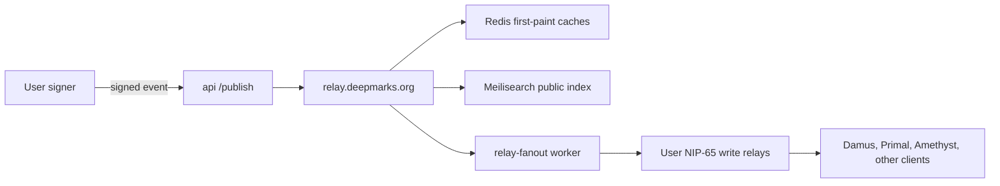
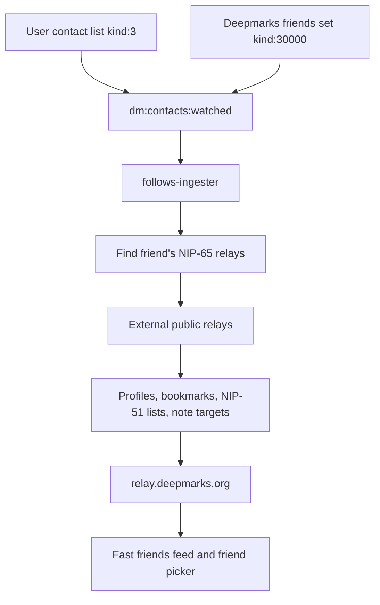

# Deepmarks

> Bookmarks for the open web. A Nostr client for social bookmarking with
> Lifetime permanent archives and a programmatic API.

Deepmarks is a bookmarking site in the spirit of del.icio.us and Pinboard,
rebuilt on [Nostr](https://github.com/nostr-protocol/nips) so your data
isn't locked to one operator. Save a URL and it becomes a signed
`kind:39701` event on relays you choose. Tip great links with Lightning
zaps that go directly to the bookmark curator: one Lightning invoice,
no custody. Lifetime members can queue long-tail page snapshots that land
on Deepmarks' Blossom storage and any configured backup Blossom servers.

If Deepmarks disappears tomorrow, every bookmark you ever saved here is
still readable by any Nostr client, because the events live on relays,
not on our server.

## Start here

- [`docs/system-overview.md`](docs/system-overview.md) explains how the
  clients, Nostr relays, three server boxes, archives, and storage fit
  together.
- [`docs/self-host.md`](docs/self-host.md) explains how to run an
  independent instance.
- [`docs/nostr.md`](docs/nostr.md) documents the event kinds and NIP
  boundaries.
- [`docs/bookmarks.md`](docs/bookmarks.md) documents the public and
  private bookmark data model.

## Status

| Surface          | Typecheck | Tests           | Notes |
| ---------------- | --------- | --------------- | ----- |
| `frontend/`      | passing   | 494 / 494       | SvelteKit SPA, Cloudflare Pages |
| `api/` | passing   | 525 / 525       | Fastify, hosts LNURL + /api/v1 |
| `archive-worker/`| builds    | 130 / 130 (+74 env-gated live) | Playwright + SingleFile + BUD-04 |
| `bunker/`        | passing   | 50 / 50         | NIP-46 signing service |
| `browser-extension/` | passing | 36 / 36       | Chrome/Firefox/Safari extension |
| `frontend/android` + `frontend/ios` | synced | local native builds | Capacitor mobile app shells |
| `/api/v1`        | live      | covered by api suite | [API reference](docs/api-v1.md) |

**Combined: 1,235 passing tests** + 74 env-gated archive-worker
media/filetype live suites. CI
([`.github/workflows/tests.yml`](.github/workflows/tests.yml)) runs
every package's typecheck + suite on every push and PR.

All suites live under [`tests/`](tests/README.md), mirroring each
package's source tree, with per-finding regression guards under
`tests/<package>/regression/` and a catalog of every suite in
[`tests/README.md`](tests/README.md). Run everything with
`./tests/run-all.sh`, or one package with `cd <package> && npm test`.

## Release streams

Deepmarks has separate version streams:

- **Public source/server releases** use GitHub tags on
  `deepmarks-public`, currently the `v1.0.x` series (legacy `v2.0.x`
  and `extension-v*` tags are historical, not the source stream).
- **Web/server deploys** are tracked by private `main` commit SHA.
- **Android, iOS, Zapstore, and browser-extension releases** use
  monotonically increasing store/package versions such as `2.2.11`.
- **Chrome and Firefox extension submission** is manual: release builds
  produce zips, and the operator uploads them to the store dashboards.

See [`docs/versioning.md`](docs/versioning.md) before comparing GitHub
release tags with app-store or extension-store versions.

## Nostr in one page

Nostr is a signed-event network. A user controls a keypair: the public
key identifies them and the private key signs events. Relays store and
serve those signed events over WebSockets. A client can leave one app
and still read its data from another app because the event signature is
portable and verifiable.

Deepmarks uses that model for bookmarking:

| Term | Meaning in Deepmarks | Reference |
| --- | --- | --- |
| Event | A signed JSON object. Bookmarks, profiles, contact lists, relay lists, zaps, and deletions are all events. | [NIP-01](https://github.com/nostr-protocol/nips/blob/master/01.md) |
| Relay | A server that accepts, stores, and returns signed events. Deepmarks runs `relay.deepmarks.org` as its low-latency first read path. | [Nostr NIPs](https://github.com/nostr-protocol/nips) |
| `npub` / `nsec` | Bech32-encoded public and private keys. Deepmarks never needs a user's `nsec` on the server. | [NIP-19](https://github.com/nostr-protocol/nips/blob/master/19.md) |
| `kind:39701` | A Deepmarks public web bookmark, addressable by URL. | [NIP-B0](https://github.com/nostr-protocol/nips/blob/master/B0.md) |
| `kind:30003` | Encrypted NIP-51 bookmark chunks, archive-key chunks, and compatible third-party bookmark sets. | [NIP-51](https://github.com/nostr-protocol/nips/blob/master/51.md) |
| `kind:3` | The user's portable contact list. Deepmarks uses it to anticipate which friends' bookmarks should be cached. | [NIP-02](https://github.com/nostr-protocol/nips/blob/master/02.md) |
| `kind:10002` | The user's advertised relay list. The server uses it to find where a user's existing events live. | [NIP-65](https://github.com/nostr-protocol/nips/blob/master/65.md) |
| NIP-98 | Signed HTTP authentication. The API verifies a Nostr signature instead of storing a password. | [NIP-98](https://github.com/nostr-protocol/nips/blob/master/98.md) |
| Blossom | Content-addressed blob storage used for archive files and thumbnails. | [Blossom](docs/blossom.md) |

## Relay-first architecture

Decentralized reads are powerful but unpredictable. A friend's bookmark
may live on a slow relay, an old relay, or a relay the mobile app cannot
reach reliably. Deepmarks keeps Nostr as the source of truth, then
actively copies public, signed content that users are likely to need
into `relay.deepmarks.org`. The local relay becomes the first point of
search and first paint; external relays remain the wider network for
discovery, redundancy, and user portability.

The rule is simple: when Deepmarks learns that a user may need public
Nostr content, it tries to bring the signed event home before the user
opens the screen that needs it.

| Content | Why it is cached locally | How it gets there |
| --- | --- | --- |
| User bookmarks | The signed-in library must load immediately on web, iOS, Android, and extension surfaces. | `/publish`, onboarding scan, public bookmark cache |
| Private bookmark chunks | Users need encrypted bookmark sets and archive keys available from the canonical relay. | Client signs/encrypts locally, then `/publish` forwards |
| Contact lists | Friend pickers, profile suggestions, and friend-feed warm-up depend on the user's follow graph. | Onboarding scan and follows-ingester |
| Friends' bookmarks | The friends feed should not blank out while the app searches many old relays. | Follows-ingester queries friends' NIP-65 relays and forwards bookmark-shaped events |
| Profiles and avatars | Lists should show names and identity images instead of npubs. | Onboarding scan, profile-resolver, follows-ingester profile cache |
| NIP-51 bookmark lists | Damus, Primal, Amethyst, and other clients use list events for saved notes and links. | Onboarding scan and follows-ingester |
| Bookmarked note targets | If a bookmark points at a Nostr note, the target note should render as content, not as a raw `nostr:` URI. | Exact-id lookup and local relay import |





This design is not a fork away from Nostr. Events copied into the
Deepmarks relay are still signed by their original authors. A client can
verify them, ignore Deepmarks, or fetch them from another relay. The
Deepmarks relay exists to make the product fast and reliable while
keeping the data portable.

## Storage model

Deepmarks separates canonical signed data from derived caches:

| Store | Role |
| --- | --- |
| `strfry` / `relay.deepmarks.org` | Canonical signed Nostr events that Deepmarks serves first. |
| Redis | Fast derived state: profile/name cache, first-paint bookmark rows, job queues, settings, archive records, refcounts, and warm-up frontiers. |
| Meilisearch | Derived full-text and tag search over public bookmarks. It can be rebuilt from relay and Redis state. |
| Blossom object storage | Content-addressed archive blobs, thumbnails, PDFs, and encrypted media archives. |
| Local device secure storage | User secrets such as nsecs, passkeys, NWC wallet secrets, and signer grants. These do not enter server settings. |

## Runtime choices

The application code is TypeScript because most of the product surface is
I/O-bound rather than CPU-bound: relay WebSockets, HTTP APIs, Playwright,
NIP signing boundaries, mobile shells, and browser-extension code. One
language lets the web app, native wrappers, extension, API, and archive
worker share schemas, tests, and Nostr event conventions.

Deepmarks already uses specialized non-TypeScript infrastructure where
it is the right fit:

- `strfry` is the relay engine and owns high-performance event storage.
- Redis owns low-latency queues and derived state.
- Meilisearch owns full-text indexing.
- Blossom/object storage owns content-addressed files.

Go or Rust would make sense for a future high-volume relay crawler or a
CPU-heavy media/indexing worker if profiling shows Node's event loop is
the bottleneck. Today the slow paths are network latency, public relay
availability, and headless-browser capture, so the highest-impact work
is better relay-first ingestion, cache warming, and clear backpressure
rather than a language rewrite.

## How it's built

Four services, three boxes:

- **`frontend/`** — SvelteKit + TypeScript SPA. All Nostr signing happens
  in the browser via [NIP-07](https://github.com/nostr-protocol/nips/blob/master/07.md)
  extensions, [NIP-46](https://github.com/nostr-protocol/nips/blob/master/46.md)
  remote signers, Deepmarks mobile phone signer pairing, recovery-key
  paste/QR import, or passkey-encrypted nsec storage
  (WebAuthn + PRF, Face ID / Touch ID). Recovery-key/passkey web sign-ins
  remember the nsec in this browser until logout for refresh/back
  usability; the extension remains the safer daily-use signer. Deployed
  to Cloudflare Pages.
- **`api/`** — Fastify **HTTP API** on Box A. LNURL-pay + NIP-57
  zap receipts, BTCPay webhook, the programmatic `/api/v1`, full-text
  search via Meilisearch, the `/favicon` cache, WebAuthn passkey
  registration + nsec-ciphertext storage. As of 2026-06-25 the background
  workers (indexing, zap receipts, save counts, watched-contact ingest,
  onboarding import, relay fanout, archive backfill/rescue, LLM enrichment,
  Lightning settlement, daily Pinboard post) run as **four separate worker
  containers** off the same image (`src/worker.ts`, selected by
  `WORKER_GROUP`); the API runs `RUN_WORKERS=none`. Set `RUN_WORKERS=all`
  to fold the whole fleet back into one process for dev / single-box.
- **`archive-worker/`** — Node worker on Box B. Dequeues lifetime archive
  jobs, renders live pages through Playwright + SingleFile with Wayback
  as a disabled-by-default fallback, and fans the resulting blob out to
  Blossom mirrors via BUD-04. Private archives are AES-256-GCM encrypted
  with a browser-generated per-archive key before upload.
- **`bunker/`** — NIP-46 signing service on Box C. Holds the Nostr
  secret keys the server needs (for signing zap receipts and brand
  events) so no `nsec` ever lives on the payment host. Permission
  allowlist rejects any event kind outside a small set.

See [`docs/architecture.md`](docs/architecture.md) for the topology
diagram, data flow, Cloud Firewall rules, and where to look when
things break.

## Run your own instance

Deepmarks can be self-hosted as either the full three-box production
shape or a smaller Box A + Box C deployment without the archive worker.
The smaller shape supports bookmarks, search, relay publishing, mobile
apps, browser extensions, and hosted signer/zap operations; archives
should stay disabled until a Box B worker is added.

Start with [`docs/self-host.md`](docs/self-host.md). It explains which
servers do what, which dependencies are optional, how the apps point at
your API/relay/Blossom domains, and what to change before publishing a
fork.

If you are new to the codebase, read
[`docs/getting-started.md`](docs/getting-started.md) first. It gives the
short project map, local run path, publish model, and current mobile
release status.

## Quickest start (local dev)

```bash
./doctor.sh     # pre-flight: node, redis, playwright, .env, open ports
./dev.sh        # boots redis, api, archive-worker, frontend
```

Open <http://localhost:5173>. `Ctrl+C` in the terminal stops everything.

Flags:

- `./dev.sh --web-only` — just the frontend (UI tweaks don't need the backends)
- `./dev.sh --no-worker` — skips archive-worker (Playwright + Chromium boot are slow)

## Manual start (per service)

```bash
# Frontend
cd frontend
npm install
cp .env.example .env
npm run dev              # http://localhost:5173
npm test

# Payment-proxy (Box A)
cd ../api
npm install
cp .env.example .env     # see file for required vars
npm run dev
npm test

# Archive-worker (Box B)
cd ../archive-worker
npm install
cp .env.example .env
npx playwright install chromium
npm run dev
npm test

# Bunker (Box C — NIP-46 signer)
cd ../bunker
npm install
cp .env.example .env
npm run dev
npm test
```

## Key properties

**Free for anyone:** save, tag, zap, share, import, export. Every public
bookmark is a `kind:39701` event on user-chosen relays — any Nostr
client can read them, and any user can walk away with their data at
zero cost.

**Lifetime tier (21,000 sats one-time):** unlimited archives +
rotatable `dmk_live_…` API key for programmatic access
([docs](docs/api-v1.md)). Every API write is a pre-signed Nostr event
— the server never holds your `nsec`.

**Zaps on public bookmarks:** 100% goes to the curator who saved the
link when their profile exposes `lud16`, `lightning_address`, or
`lud06`. If they do not have a Lightning address/LNURL, the zap goes to
Deepmarks instead. Nothing is custodial — the wallet pays one Lightning
invoice directly.

**Nostr-native identities:** hosted Deepmarks Lightning addresses still
advertise distinct `nostrPubkey` values per NIP-57 for direct zaps and
legacy receipts, with signing routed through the Box C bunker so no
`nsec` ever lives on the payment host.

## What's tested

See each service's README for module-level coverage. Summary:

- **Frontend** — importers (Netscape/Pinboard/Pocket/Instapaper/Raindrop),
  exporters with round-trip proofs, NIP-B0 bookmark builder/parser,
  NIP-44 private-set gates, single-recipient zap planning,
  popularity ranking (saves + zaps × 2, time-window filter, firehose
  quality floor), personal bookmark search, lifetime archive state walk
  and download finalization, nsec decoding, API client + NIP-98 header
  round-trip (incl. Unicode), 50-row list pagination, store/theme logic.
- **api** — NIP-57 `description_hash` exact-JSON rule,
  zap-request validation, session JWT, NIP-98 HTTP auth, LUD-06 LNURL
  shape, URL normalization, API key storage (hash-only, cross-pubkey
  revoke guard, touch coalescing), pre-signed event publish + deletion
  rules, lifetime-member state machine, relay publish/query helpers
  with wedged-relay and timeout paths.
- **archive-worker** — AES-256-GCM round-trip, key-length guard, GCM
  auth failure on one-bit flip, Wayback timestamp + size + freshness,
  mirror-target validation, BlossomClient BUD-01 auth event with schnorr
  signature verification.
- **bunker** — NIP-44 round-trip, permission matrix (every identity ×
  kind combination), nsec file loading, full
  decrypt → permission-check → sign → encrypt pipeline, audit log
  shape, unaddressed events silently dropped, undecryptable ciphertext
  marked errored without responding.

## Conventions

- TypeScript strict, ESM, ES2022. `any` is forbidden.
- `nostr-tools` v2 for low-level signing; NDK on the frontend.
- Fastify + zod on backends.
- Lightning: `lightning` npm package, **invoice-only macaroon** (no
  admin macaroon anywhere — a compromised service can't move funds).
- All env reads in one config module per service.
- Honest copy, lowercase where the product design uses lowercase, no
  hype words.
- Bitcoin-native, self-hosted by default: no AWS, no Stripe, no
  Firebase.

## Documentation

Operator-facing references in [`docs/`](docs):

- [`system-overview.md`](docs/system-overview.md) — diagrams for the
  product surfaces, Nostr bookmark flow, three-box deployment, archives,
  and data ownership.
- [`self-host.md`](docs/self-host.md) — run your own Deepmarks instance,
  optional dependencies, app/service interface, Box A/B/C roles.
- [`getting-started.md`](docs/getting-started.md) — first-read project
  overview, local tutorial, publish model, mobile release status.
- [`architecture.md`](docs/architecture.md) — three-box topology, data
  flow, persistence, DNS/TLS, Cloud Firewall.
- [`deploy.md`](docs/deploy.md) — deploy runbook, health checks,
  rollback, and production gotchas.
- [`relay-policy.md`](docs/relay-policy.md) — server-mediated publish,
  registered relay writes, fanout, and onboarding import.
- [`bookmarks.md`](docs/bookmarks.md) — public/private bookmark model,
  personal library behavior, edit/delete, visibility changes.
- [`search.md`](docs/search.md) — personal search default, global
  search toggle, query modifiers, freshness.
- [`llm-augmentation.md`](docs/llm-augmentation.md) — optional
  DeepInfra bookmark enrichment, semantic search, model policy, and
  existing-bookmark backfill.
- [`import-export.md`](docs/import-export.md) — import review,
  accurate progress, immediate visibility, export behavior.
- [`archives.md`](docs/archives.md) — lifetime archive UX, worker flow,
  Blossom fanout, downloads.
- [`blossom.md`](docs/blossom.md) — archive-worker-only Blossom storage
  access model and file limits.
- [`add-ons.md`](docs/add-ons.md) — lifetime add-ons, including the
  one-time private media archiver for video/audio bookmarks.
- [`zaps.md`](docs/zaps.md) — bookmark zap recipient selection,
  NWC/invoice paths, receipts.
- [`settings.md`](docs/settings.md) — account/recovery, NWC, relays,
  Blossom backups, lifetime/API controls.
- [`extensions.md`](docs/extensions.md) — browser extension packages,
  signer mode, NWC/WebLN.
- [`mobile.md`](docs/mobile.md) — mobile app behavior and app-store
  payment constraints.
- [`release.md`](docs/release.md) — GPL public mirror and store release
  checklist for web, extensions, iOS, Android, and Zapstore.
- [`releases/v0.6.0.md`](docs/releases/v0.6.0.md) — public release
  notes for the server-mediated publish model.
- [`zapstore.md`](docs/zapstore.md) — Android APK build and Zapstore
  publish checklist.
- [`lightning.md`](docs/lightning.md) — LND, BTCPay, curator zaps,
  lifetime tier, multi-address LNURL.
- [`nostr.md`](docs/nostr.md) — every event kind, NIP compliance,
  identities, bunker-backed signing, citizenship rules.
- [`bunker.md`](docs/bunker.md) — Box C signing service, permission
  model, wire protocol, rotation.
- [`admin.md`](docs/admin.md) — admin auth, CLI, recovery playbooks,
  threat model.
- [`api-v1.md`](docs/api-v1.md) — REST API reference for lifetime-tier
  members.

Production behavior is documented in [`docs/`](docs) and the component
READMEs. The public mirror intentionally contains production source,
release notes, deployment templates, and operator references rather than
internal design prototypes.

## License

GPL-3.0-only. See [`LICENSE`](LICENSE).
