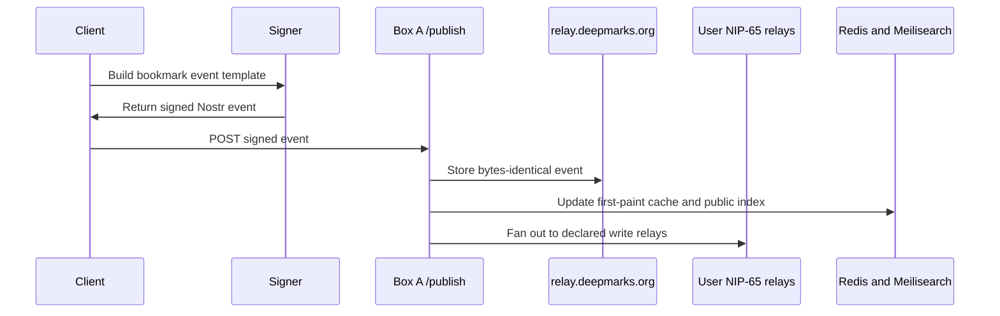

# Nostr on Deepmarks

How Deepmarks uses the Nostr protocol for every piece of user data,
what NIPs we implement, and the citizenship rules we follow so we
don't pollute the network.

## Summary

- Every user-authored bookmark is a signed Nostr event. The relay is
  the source of truth; our database is a cache / index.
- We follow existing NIPs for everything we publish. No custom kinds.
- We only publish kind:1 text notes when the user explicitly composes
  one (for example the share-button cross-post under a bookmark). Those
  notes are fanned out to the user's relays and are not stored on our
  relay.
- Users bring their own signer. The browser extension path is preferred;
  the web app also supports recovery-key paste and can remember that nsec
  locally for usability.
- **Server-mediated publish model.** Clients sign locally and POST the
  signed event to `/publish`; Box A writes to `relay.deepmarks.org`
  and a server-side fan-out worker propagates each event to the user's
  NIP-65 write relays (Damus / Primal / nos.lol / nostr.wine /
  nostr.land / etc.). See
  [`relay-policy.md`](relay-policy.md) for the full architecture
  including the relay-allowed-pubkey writePolicy, watched-contact
  ingest, and onboarding scan.

## How a bookmark fits into Nostr



For public bookmarks, the signed event is `kind:39701`. For private
bookmarks, the signed event is an encrypted `kind:30003` event — a per-item event for normal saves, chunked set events for bulk import. The server
does not rewrite either event; it either accepts and forwards it or
rejects it.

## Event kinds we touch

| Kind | NIP | Direction | Purpose |
|---:|---|---|---|
| 0 | [01](https://github.com/nostr-protocol/nips/blob/master/01.md) | read + publish (user-initiated) | profile metadata for feed-row attribution + user profile page; the profile-picture editor on `/app/settings` re-publishes kind:0 with the merged picture URL |
| 1 | [01](https://github.com/nostr-protocol/nips/blob/master/01.md) | publish (user-initiated, fanout-only) + read | social cross-posts composed by the user from a bookmark action; also read when rendering saved note references |
| 3 | [02](https://github.com/nostr-protocol/nips/blob/master/02.md) | read + publish | standard contact lists; used for following, profile autocomplete, and tagging friends in bookmark share posts |
| 5 | [09](https://github.com/nostr-protocol/nips/blob/master/09.md) | publish | deletion requests when a user removes a public bookmark or deletes their account |
| 7 | [25](https://github.com/nostr-protocol/nips/blob/master/25.md) | read (planned) | reactions are not displayed yet |
| 9734 | [57](https://github.com/nostr-protocol/nips/blob/master/57.md) | read | zap requests — verified, stored, paired with invoices |
| 9735 | [57](https://github.com/nostr-protocol/nips/blob/master/57.md) | publish | zap receipts signed by the Deepmarks admin/operational signer |
| 10000 | [51](https://github.com/nostr-protocol/nips/blob/master/51.md) | read + publish | public mute list for people, hashtags, and words |
| 10002 | [65](https://github.com/nostr-protocol/nips/blob/master/65.md) | read + publish | user's relay list (outbox model); fanout uses write relays. Onboarding mirrors existing relay-list events so future Deepmarks publishes can fan out immediately |
| 10063 | [B7](https://github.com/nostr-protocol/nips/blob/master/B7.md) | delete scan only | legacy/planned Blossom-server list kind; account deletion includes it if found |
| 1985 | [32](https://github.com/nostr-protocol/nips/blob/master/32.md) | publish | lifetime-membership labels (see below) |
| 24133 | [46](https://github.com/nostr-protocol/nips/blob/master/46.md) | publish/read | nostr-connect bunker messages between payment-proxy and Box C — never user-facing, relay-only |
| 27235 | [98](https://github.com/nostr-protocol/nips/blob/master/98.md) | read | HTTP auth for /api/v1 and /admin — never published |
| 23194 | [47](https://github.com/nostr-protocol/nips/blob/master/47.md) | publish | NWC `pay_invoice` request, signed with the current client's per-app secret from the user's `nostr+walletconnect://` URI (NOT the user's main nsec) |
| 23195 | [47](https://github.com/nostr-protocol/nips/blob/master/47.md) | read | NWC `pay_invoice` response — Deepmarks verifies `sha256(preimage) === invoice.payment_hash` |
| 10003 | [51](https://github.com/nostr-protocol/nips/blob/master/51.md) | read + fanout | NIP-51 legacy single bookmark list. Damus / Primal / Amethyst / Snort use this when a user pins a kind:1 note. The onboarding scanner imports existing kind:10003 events on first registration and on throttled signed-in auth refreshes; the writePolicy keeps accepting forward-published kind:10003 from any client. Public refs and locally decrypted private refs are rendered in `/app/posts` via `createImportedNoteRefsFeed`. Saved posts there carry the same actions as web bookmarks (tags, read-later, archive, download, zap, share); tagging, read-later, or archiving adopts the post as a Deepmarks bookmark with preserve-origin visibility |
| 30000 | [51](https://github.com/nostr-protocol/nips/blob/master/51.md) | read + publish | NIP-51 categorized follow sets. Deepmarks uses `d=deepmarks-friends` as the selected friends subset for `/app/friends`; the full portable follow graph remains NIP-02 `kind:3` |
| 30003 | [51](https://github.com/nostr-protocol/nips/blob/master/51.md) | read + publish | NIP-51 bookmark sets, often encrypted to self via NIP-44 v2. Deepmarks `d` tags in use: `deepmarks-private*` (chunked private bookmark sets), `deepmarks-private-item:<sha256(url)>` (per-item private saves + tombstones — the primary write path), `deepmarks-collection:<slug>` (public bookmark collections), `deepmarks-collection-private:<sha256(slug)>` (encrypted private collections), `deepmarks-nwc` (wallet connection), and `deepmarks-archive-keys` (private archive AES keys, mapped by final blob hash and provisional `job:<jobId>` while the archive is completing). Onboarding scanner imports third-party kind:30003 bookmark sets with a `d` tag even when all refs are encrypted in `content`; the frontend importer skips Deepmarks collection d-tags so collection members do not become loose imported bookmarks |
| 30001 | [51](https://github.com/nostr-protocol/nips/blob/master/51.md) | read + import | NIP-51 deprecated "categorized bookmarks/sets", the predecessor of 30003. Import-only: the onboarding scanner + follows-ingester mirror it and the frontend renders/decrypts it exactly like 30003, but Deepmarks never authors a new 30001 (user edits write 39701 or the encrypted 30003 set) |
| 39701 | [B0](https://github.com/nostr-protocol/nips/blob/master/B0.md) | read + publish | **public web bookmarks — our canonical shape** |

## Kind 39701 — public web bookmarks

Our headline event. A signed 39701 event *is* the bookmark — titles,
descriptions, tags, and the URL all live in tags, with empty `content`.
Relays replicate them; any other Nostr client can read + render them.

Shape (see `payment-proxy/src/api-helpers.ts` and
`frontend/src/lib/nostr/bookmarks.ts` for the canonical builder):

```
{
  "kind": 39701,
  "tags": [
    ["d", "<url>"],              # parametric-replaceable dedup key
    ["title", "..."],
    ["description", "..."],
    ["t", "bitcoin"],            # hashtag(s)
    ["t", "privacy"],
    ["published_at", "<unix save time>"],
    ["published_at_ms", "<unix save time in ms>"]
  ],
  "content": ""
}
```

Because `kind:39701` is in the 30000–39999 parametric-replaceable range,
a user editing or retagging the same URL emits a new event with the
same `d` tag and it supersedes the previous one. Our feed dedup
([feed.ts](../frontend/src/lib/nostr/feed.ts)) uses `(pubkey, url)` as
the key and NIP-01's `created_at + event-id` tiebreaker. Display order
uses the stable bookmark time: `published_at` first, then optional
`published_at_ms` for same-second saves, then event id.

## Kind 1985 — lifetime membership labels

Durability layer #2 for the paid lifetime tier (see
[admin.md](admin.md) and [lightning.md](lightning.md) for the full
flow). On every settlement we publish a
[NIP-32](https://github.com/nostr-protocol/nips/blob/master/32.md)
label event from the Deepmarks admin/operational pubkey attesting that a given
member pubkey bought the lifetime tier.

```json
{
  "kind": 1985,
  "tags": [
    ["L", "org.deepmarks.tier"],
    ["l", "lifetime", "org.deepmarks.tier"],
    ["p", "<member-pubkey>"],
    ["paid_at", "<unix>"],
    ["invoice_id", "<btcpay-id>"]
  ],
  "content": "Deepmarks lifetime membership"
}
```

**Why kind 1985 and not kind 1 (a text note)?** Because label events
are machine-readable metadata and are not rendered in social timelines
(Damus/Primal/etc.). We want the attestation durable + auditable
without polluting anyone's feed. See
[citizenship rules](#citizenship-rules) below.

On startup, payment-proxy queries our own label events from relays and
re-stamps any pubkey Redis doesn't already know — so the relay ledger
is a second recovery source alongside BTCPay.

## Relay usage

### Outbox model (NIP-65)

When users publish through the first-party app, extension, or mobile
shell, the client signs locally and POSTs to `/publish`. Box A writes
the bytes-identical event to `relay.deepmarks.org`, then the fanout
worker publishes to the user's **declared write relays** from their
kind:10002 event.

API v1 endpoints that receive a pre-signed event follow the same
principle: readers find events on the author's chosen write relays, so
that is where fanout has to land.

This is the correct reading of NIP-65 — readers find events on the
author's chosen relays, so that's where the events have to live.

### What we run ourselves

- **relay.deepmarks.org** — [strfry](https://github.com/hoytech/strfry)
  with a write-policy plugin at `deploy/box-a/strfry/deepmarks.js` that
  gates by relay allowlist and kind. Relay-allowed pubkeys can publish:
  - `kind:0` — profile metadata
  - `kind:3` — contact lists
  - `kind:5` — deletion requests
  - `kind:10000` — mute lists
  - `kind:10002` — relay lists
  - `kind:10003` — NIP-51 legacy bookmark lists
  - `kind:30000` — NIP-51 follow sets (`deepmarks-friends`)
  - `kind:39701` — public bookmarks (the main use case)
  - `kind:30003` — NIP-51 sets (`deepmarks-private` bookmarks +
    `deepmarks-archive-keys` archive-key sync)
  - `kind:30001` — NIP-51 deprecated bookmark sets (import-only; legacy
    predecessor of 30003)
  - `kind:9735` — zap receipts
  - `kind:24133` — NIP-46 bunker messages (payment-proxy ↔ Box C)

  The **admin/operational pubkey** (`7cb39c…3800`) gates authoritative
  lifetime labels (`kind:1985`), while the **public brand/social pubkey**
  (`2944e9…e2f4`) additionally gets a `TEAM_EXTENDED_KINDS` allowance
  for {0, 1, 3, 6, 7, 10002, 30023} so Damus-facing social activity
  flows through. User `kind:1` cross-posts go through `/publish`, are
  queued for fanout, and are not stored by our relay. All other kinds
  from non-team pubkeys are rejected.
  The relay is deliberately narrow — it's not a general-purpose public
  relay.
- **strfry internal** (`ws://strfry:7777` from inside the docker
  network, `ws://10.0.0.2:7777` from the VPC) — used by the payment-
  proxy's internal workers, the `/archive/lifetime` + webhook-settlement
  paths, AND the bunker NIP-46 channel. Same backing data as the public
  relay at `wss://relay.deepmarks.org`.

### What we don't do

- We don't force users' events to stay only on our relay. The app
  POSTs to `/publish` for privacy and reliability, and the server fans
  out to each user's NIP-65 write relays.
- We don't rewrite events before publishing. If your client signs an
  event, the bytes we relay are the bytes you signed. (We do validate
  schema + reject abuse per the strfry write-policy plugin, but that's
  reject-or-accept, never edit.)

## Identities we hold

- **Deepmarks admin/operational** (`npub10jeecm…`, hex
  `7cb39c6f…3800`, LNURL `zap@deepmarks.org`): signs NIP-57 zap
  receipts for direct zaps to Deepmarks-hosted LNURLs and NIP-32 lifetime
  labels. Advertised as
  `nostrPubkey` in the `zap@` LNURL metadata. The **nsec lives on Box C
  inside the bunker**, never on Box A. The bunker/env role is still named
  `brand` for compatibility.
- **Deepmarks brand/social** (`npub199z…`, hex `2944e9…e2f4`): public
  Damus-facing identity for social posts, NIP-89 client coordinates, and
  the once-daily Pinboard popular bookmark. The landing page's curated
  rails follow this public-profile daily import stream. It is not the
  admin key.
- **Deepmarks admin laptop key** (same pubkey as admin/operational):
  signs NIP-98 credentials for `/admin/*` endpoints. Never publishes
  events to relays and **never** travels to the bunker — the admin
  flow is always operator-initiated from their laptop. See
  [admin.md](admin.md).
- **User nsecs**: *never* touch our servers. NIP-07 extensions (Alby,
  nos2x, Flamingo) or a local nsec entered into the browser do all
  signing in-browser. When a user chooses recovery-key/passkey web sign-in,
  the web app may remember the nsec in that browser's `localStorage` so
  refresh/back and future visits keep signing access; logout clears it.
  The payment-proxy only ever receives already-signed events.

## How the server signs without holding keys

Payment-proxy speaks NIP-46 (nostr-connect) to Box C's bunker, which
holds the operational signer nsecs. Every time payment-proxy needs to
publish a zap receipt, lifetime label, daily Pinboard bookmark, or
matching social note, it:

1. Builds the event *template* (kind, tags, content, created_at).
2. Encrypts a `{id, method: "sign_event", params: [template]}` envelope
   with NIP-44 using its own ephemeral client keypair +
   the identity pubkey.
3. Wraps it in a kind `24133` event and publishes to Box A's strfry
   (internal, over the VPC from Box A to Box A and VPC from Box C to
   Box A).
4. Bunker decrypts, checks the kind is in its allowlist for that
   identity (9735 + 1985 + 39701 for the legacy `brand` role; 9735 + 39701 + 1 for personal), signs
   with the local nsec, encrypts the response, publishes back.

The daily kind:1 social note is intentionally a top-level note. It
links to the bookmark with `r` and `a` tags only; it does **not** carry
an `e` tag, because Damus and many clients render that as a reply.
5. Payment-proxy pairs the response by request id, publishes the now-
   signed event to the target relays.

The nsec never leaves Box C. A Box A compromise gets the attacker
signatures on the allowlist only — not notes, not profile edits, not
deletions, not keys. See [bunker.md](bunker.md) for the full threat
model + permission matrix.

## Private data — NIP-44 v2

Private bookmarks (kind:30003 NIP-51 sets) are encrypted with
[NIP-44 v2](https://github.com/nostr-protocol/nips/blob/master/44.md)
before they leave the browser. Our servers see ciphertext only.
Large private libraries are split across replaceable set chunks named
`deepmarks-private`, `deepmarks-private-1`, `deepmarks-private-2`, and
so on, keeping each NIP-44 plaintext under the 65,535 byte limit.

The canonical copy lives on the user's relays; payment-proxy keeps an
encrypted-to-self cache in Redis (keyed by a deterministic emailHash
surrogate for historical reasons) so private-bookmark reconciliation
across devices works without re-fetching from relays. Decryption
always happens client-side. The cache is tombstoned when the user
deletes their account (`DELETE /account`).

## Citizenship rules

Rules we follow so Nostr stays useful for everyone, not just us.

**1. Don't invent custom kinds when a NIP exists.** Labels get kind
1985. Bookmarks use 39701 (NIP-B0). Zap receipts are 9735. We
deliberately did not mint a "deepmarks-bookmark" kind — that would
fragment the ecosystem.

**2. Don't publish unsolicited kind:1 on users' behalf.** Social
timelines are where people talk; filling them with "just bookmarked X"
or "Y became a lifetime member" is spam. We only publish a user
`kind:1` when the user explicitly composes it, such as the share-button
cross-post under a bookmark. Our attestations live in kind 1985 exactly
because it won't render in Damus/Primal/Amethyst/etc.

**3. Don't publish from user pubkeys.** We never sign events as
the user — only the user's signer signs user events. Every bookmark
they "publish via deepmarks.org" is a bytes-identical pre-signed event
we relay.

**4. Honor NIP-65.** When we publish or query on behalf of a user, we
use their declared relays, not ours. Reading from arbitrary public
relays when a specific relay is known to have the data is wasteful.

**5. Don't re-publish events we didn't author.** We index what we read
but never re-publish (doing so would double-forward events and waste
relay bandwidth). Exceptions: NIP-65 republication when a user adds a
new relay in-app — a deliberate "copy my history to this new relay"
action with a UI confirmation.

**6. Delete on request.** Kind:5 deletion events are respected by our
indexer. Once relayed, we can't un-relay from every relay in the
network, but our own data is forgotten and the event's absence on
user-chosen relays is how deletion propagates.

**7. No tracking disguised as events.** We don't publish "heartbeat" or
"user-online" events. The network's purpose is communication, not
analytics.

**8. Accept diversity of clients.** Any Nostr client (Damus, Primal,
Amethyst, Coracle, ...) can read the bookmarks users publish via
Deepmarks — the reverse is also true: bookmarks created by other
clients that use kind:39701 appear in our feed unmodified. There's no
"Deepmarks-only" namespace.

## Implementation locations

| Concern | Code |
|---|---|
| Bookmark builder + parser | [`frontend/src/lib/nostr/bookmarks.ts`](../frontend/src/lib/nostr/bookmarks.ts) |
| Live feed subscription + dedup | [`frontend/src/lib/nostr/feed.ts`](../frontend/src/lib/nostr/feed.ts) |
| Private-set NIP-51 + NIP-44 | [`frontend/src/lib/nostr/private-bookmarks.ts`](../frontend/src/lib/nostr/private-bookmarks.ts) |
| Passkey / NIP-07 / recovery-key / NIP-46 signer abstraction (frontend) | [`frontend/src/lib/nostr/signers/`](../frontend/src/lib/nostr/signers/) |
| NIP-98 builder | [`frontend/src/lib/api/client.ts`](../frontend/src/lib/api/client.ts) (`buildNip98AuthHeader`) |
| Zap request validation + receipt template | [`payment-proxy/src/nostr.ts`](../payment-proxy/src/nostr.ts) |
| NIP-32 lifetime label template + publish | [`payment-proxy/src/nostr.ts`](../payment-proxy/src/nostr.ts) |
| NIP-46 bunker client (payment-proxy → Box C) | [`payment-proxy/src/signer.ts`](../payment-proxy/src/signer.ts) |
| NIP-46 bunker server (Box C signing service) | [`bunker/src/handler.ts`](../bunker/src/handler.ts) + [`bunker/src/vault.ts`](../bunker/src/vault.ts) |
| Bunker permission allowlist | [`bunker/src/permissions.ts`](../bunker/src/permissions.ts) |
| NIP-98 verification | [`payment-proxy/src/auth.ts`](../payment-proxy/src/auth.ts) (`verifyNip98`) |
| Strfry write-policy plugin | [`deploy/box-a/strfry/deepmarks.js`](../deploy/box-a/strfry/deepmarks.js) |
