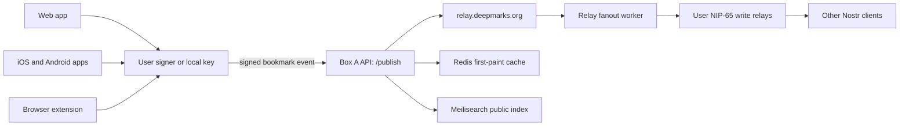
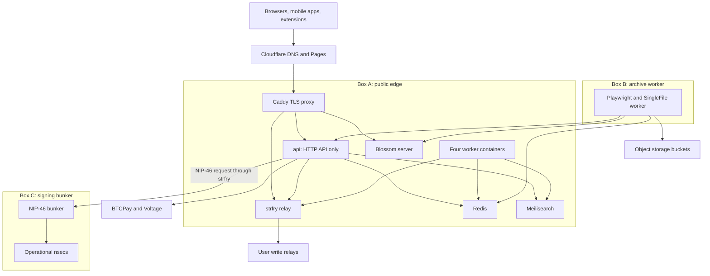
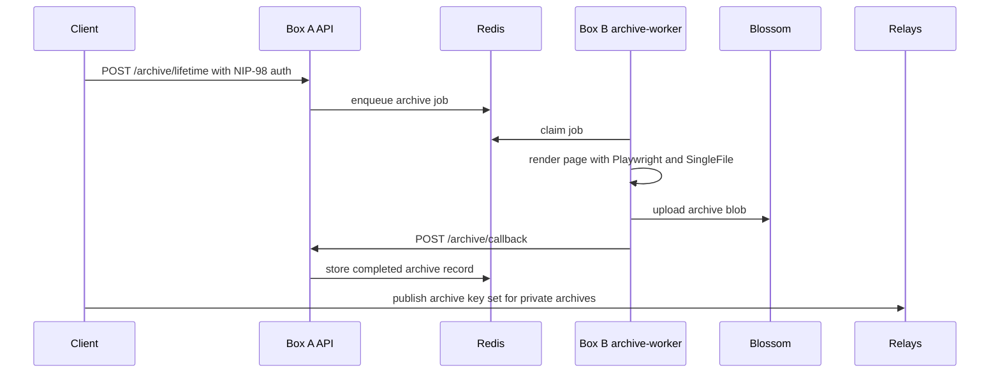

# System overview

Deepmarks is a Nostr bookmarking client with a small server side. The
clients own signing. The servers handle relay fanout, search, derived
caches, payments, archives, and operational signing without taking
custody of user keys.

## Product surfaces



The important boundary is the signer. User-authored events are signed
before they reach Deepmarks. Box A can accept, reject, cache, index, and
forward those events, but it does not receive the user's `nsec`.

## Three-box deployment



Box A is the public edge and stateful API host. As of 0.8.0 its Node
service is split into the **`api`** process (HTTP requests only) and
**four worker containers** that run the background jobs — search
indexing, the relay outbox (fanout, onboarding, follows), LLM
enrichment, and Lightning settlement. They coordinate only through Redis
queues and the relay, never shared memory, so a stuck worker can't stall
the API. Box B is isolated so headless browser work cannot take down the
API. Box C holds only the server-owned signing keys needed for zap
receipts, lifetime labels, and brand events.

## Bookmark model

```mermaid
flowchart TB
  save[User saves a URL]
  publicChoice{Visibility}

  save --> publicChoice
  publicChoice -->|public| publicEvent[Build kind:39701 bookmark]
  publicChoice -->|private| privateSet[Publish encrypted kind:30003 event (per-item)]

  publicEvent --> sign[Sign on device]
  privateSet --> encrypt[Encrypt to self with NIP-44]
  encrypt --> sign

  sign --> publish[POST signed event to /publish]
  publish --> localRelay[relay.deepmarks.org]
  publish --> cache[Redis and local optimistic cache]
  localRelay --> fanout[Fan out to NIP-65 write relays]
  fanout --> portable[Readable by compatible Nostr clients]
```

Public bookmarks are NIP-B0 `kind:39701` events. Private bookmarks are
NIP-51 `kind:30003` sets encrypted to the user with NIP-44. Both move
through the same signed-event publish path.

## Archive model



Public archive blobs can be opened directly from Blossom. Private
archive blobs are encrypted with a per-archive key generated by the
client. The encrypted blob can be stored by Deepmarks, but the key must
sync through the user's encrypted Nostr data.

When a public page blocks capture, the API runs an **archive rescue**
pass that looks for a publicly-archivable alternative — a Wayback or
archive.today snapshot, an open-access scholarly PDF, an `x.com` mirror
(xcancel / nitter), or a mirror surfaced by a self-hosted searxng search
and an open-source LLM — and archives that instead. Every candidate is
SSRF-checked and constrained to the same item, never an arbitrary host.
See [`archives.md`](archives.md).

## Data ownership

| Data | Owner | Canonical location | Server role |
|---|---|---|---|
| Public bookmarks | User pubkey | Nostr relays | Validate, cache, index, and fan out signed events |
| Private bookmarks | User pubkey | Encrypted Nostr sets | Relay ciphertext and help devices reconcile |
| Archive blobs | User account | Blossom/object storage | Render, store, mirror, and delete on request |
| Search index | Deepmarks deployment | Meilisearch | Rebuildable derived data |
| First-paint rows | Deepmarks deployment | Redis | Rebuildable derived data |
| Operational signing keys | Deepmarks operator | Box C bunker | Sign narrow server-owned event kinds |

## Where to go next

- [`architecture.md`](architecture.md) for per-box services, network
  ports, storage, and operational detail.
- [`self-host.md`](self-host.md) for deploying a fork.
- [`nostr.md`](nostr.md) for the event kinds and NIP boundaries.
- [`bookmarks.md`](bookmarks.md) for public/private bookmark behavior.
- [`relay-policy.md`](relay-policy.md) for relay fanout and ingestion.
